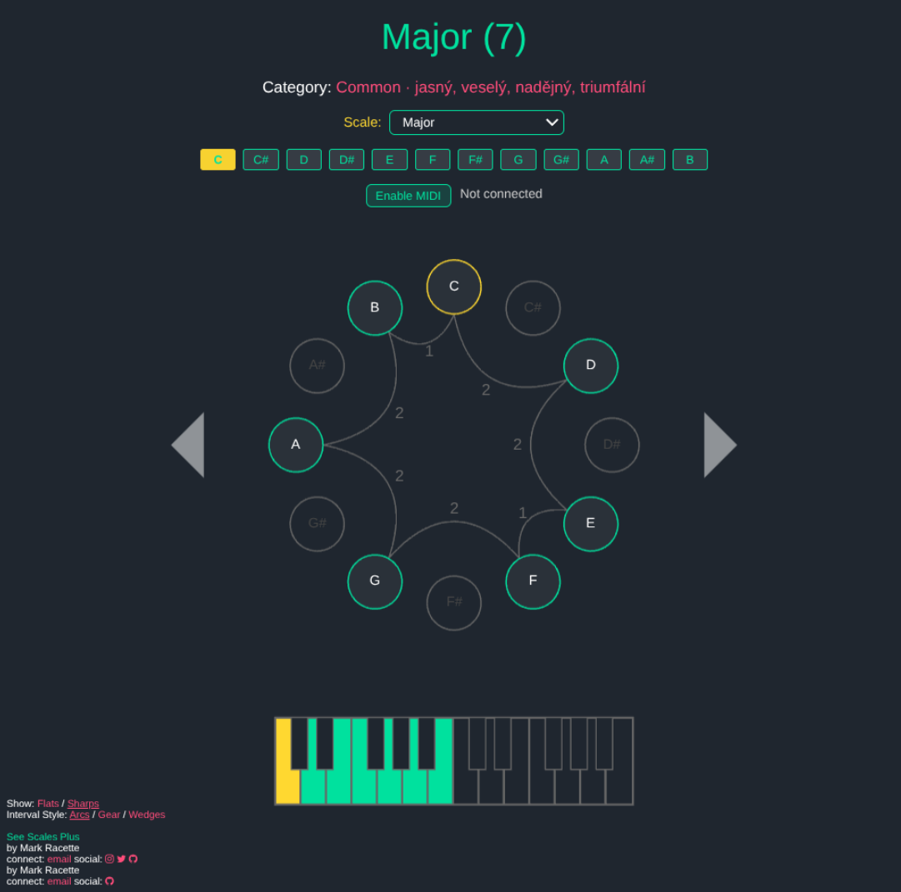

# See Scales Plus

Vylepšená vizualizace hudebních stupnic přeloežená do češtiny.

Oproti původní verzi obsahuje tyto nové funkce:

- český překlad uživatelského rozhraní
- přidaný výběr stupnic pomocí selektoru (šipky nahoru/dolů)
- přidána tlačítka pro přímý výběr základního tónu
- přidána nálada
- přidán hratelný pianoroll
- přidána podpora MIDI vstupu

**Vylepšená verze online:** (https://tomasmark79.github.io/scales/)  
Původní autor – živá ukázka: (https://mracette.github.io/scales)

## Přehled

Vizualizujte a objevujte hudební stupnice pomocí tohoto interaktivního webového nástroje. Postaveno na JS/THREE.js/WebAudio.

## MIDI vstup

Připojte USB nebo Bluetooth MIDI kontroler a klikněte na **Povolit MIDI** v záhlaví aplikace – prohlížeč pak bude posílat notová data do See Scales Plus. Pokud váš prohlížeč podporuje Web MIDI (Chrome, Edge a další prohlížeče založené na Chromiu), aplikace naslouchá všem připojeným vstupům a používá stejné vestavěné audio samply jako při kliknutí na virtuální klaviaturu.

Když prohlížeč Web MIDI API neposkytuje, tlačítko se deaktivuje a krátká zpráva vysvětlí omezení. Vizualizovanou klaviaturu i ovládání myší však můžete používat dál.

### Hrát jen tóny ve stupnici

V sekci MIDI najdete přepínač **Hrát jen tóny ve stupnici**. Je‑li aktivní, příchozí MIDI noty mimo aktuální stupnici se ignorují, takže nic nezní falešně. Přepínač lze kdykoli vypnout a hrát všechny tóny.
